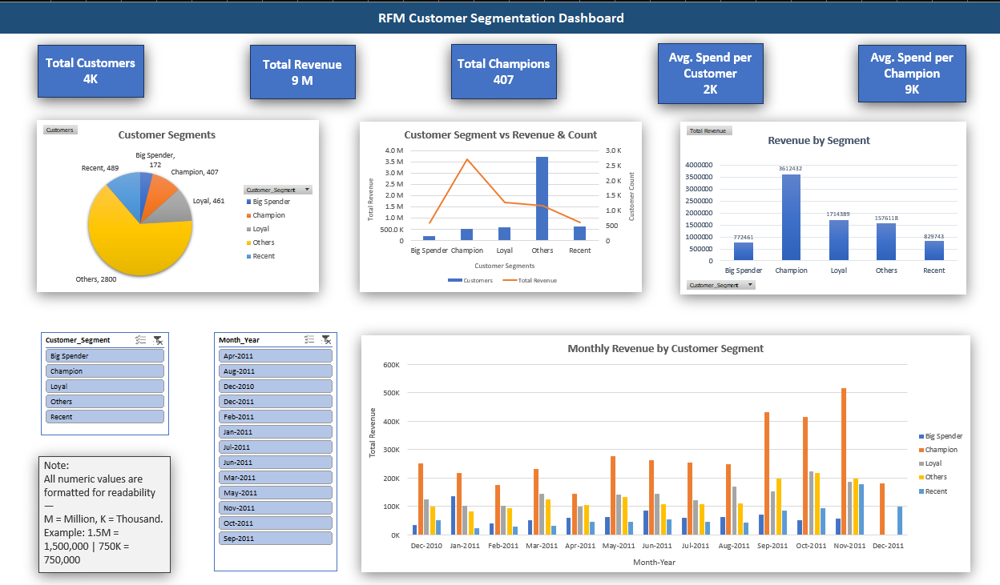

# Online Retail II Dashboard (2010–2011) - Customer Segmentation using RFM Analysis Excel Project 

This project analyzes the [UCI Online Retail II dataset](https://archive.ics.uci.edu/ml/datasets/Online+Retail+II) using **Excel**, showcasing data cleaning, **RFM-based customer segmentation**, pivot-based aggregation, and an interactive **dashboard** built from scratch.

---

## 🧾 Dataset Overview

- **Source:** UCI Machine Learning Repository  
- **Link:** [Online Retail II Dataset](https://archive.ics.uci.edu/ml/datasets/Online+Retail+II)  
- **Timeframe:** December 2010 – December 2011  
- **Size:** ~541,909 rows

This real-world dataset contains **customer transactions** for a UK-based online retailer. The data was **messy**, containing:
- Nulls in key fields (CustomerID, Description)
- Inconsistent Invoice types (credits, returns)
- Mixed date formats
- Non-standard product codes

---

## 🧹 Key Steps Performed

### 🧼 1. Data Cleaning
- Removed missing `CustomerID`s and irrelevant columns
- Filtered out canceled orders (Invoice starting with ‘C’)
- Converted timestamps into Month-Year format
- Cleaned negative or zero quantities and prices

### 🧮 2. RFM Analysis
- Calculated **Recency, Frequency, Monetary** values per customer
- Scored each RFM metric from 1 to 5
- Built a **Customer Segment** field using RFM Score logic
    - Example: `'Champions'`, `'Loyal Customers'`, `'At Risk'`, etc.

### 📈 3. Pivot & Aggregation
- Created summary pivot tables to analyze:
  - Monthly revenue by segment
  - Total revenue vs customer groups
  - Segment-wise distribution
  - Revenue contribution by segment

### 📊 4. Interactive Excel Dashboard
- Designed with slicers for:
  - **RFM Score**
  - **Month-Year**
- Used formatted charts:
  - Clustered columns
  - Pie charts
  - Card KPIs (Revenue, Orders, Active Customers)
- Enhanced visuals with:
  - Conditional formatting
  - Number formatting in `K` / `M`
  - Custom background and textboxes

---

## 📄 Project File (Download)

Due to GitHub’s 25MB limit, the full Excel workbook is hosted externally:

👉 [**Download Excel Dashboard (Google Drive)**](https://drive.google.com/drive/folders/1Ypa5kyDIvc1-Yh0_KyB4SjnUjmxrYvZI?usp=sharing)

---

## 🧠 What I Learned
- Practical Excel skills for cleaning and analytics
- RFM scoring methodology for segmentation
- Building clean, dynamic dashboards from scratch
- Real-world challenges of inconsistent, messy data

---

## 🚀 Tech Used
- Microsoft Excel (Data Cleaning, Pivot Table, Dashboarding)
- Power Pivot for relationships
- Slicers, Pivot Charts, RFM Scoring

---

## 📬 Contact
Feel free to reach out for feedback or collaboration!

